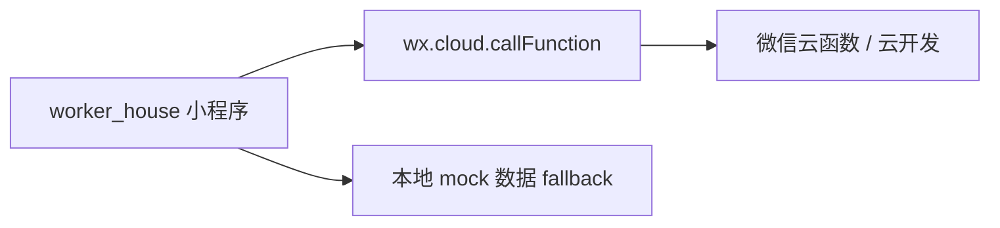
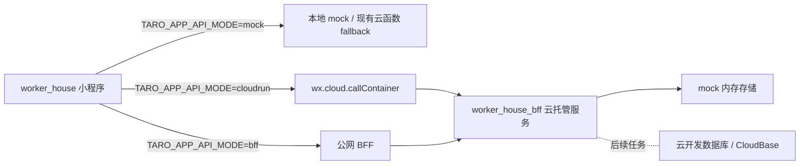

# worker_house 云托管迁移说明

> [!IMPORTANT]
> **当前状态：环境 ID 已配置**
> - 环境 ID 已填：`prod-d9g991lo4dba5a4da`
> - **下一步**：请在微信公众平台使用生成的 zip 包部署 BFF 服务。部署成功后请告知 Aime，我将把 `TARO_APP_API_MODE` 切换为 `cloudrun` 并重新上传体验版。

本轮目标是把 `worker_house` 小程序与 `worker_house_bff` 后端改造成“微信云托管就绪”状态，但**不执行部署**。后续待用户开通云托管并提供真实环境 ID 后，再执行部署任务。

## 一、迁移前后架构对比

### 迁移前



### 迁移后（本轮完成）



## 二、本轮已完成的改动清单

### `worker_house_bff/`

- 新增 `Dockerfile`，采用多阶段构建，最终镜像仅保留 `dist` 与生产依赖。
- 新增 `.dockerignore`，排除 `node_modules`、`dist`、`.env*`、`logs`、`.git`。
- 新增 `container.config.json`，包含 `containerPort=80`、`minNum=0`、`MODE=cloudrun` 等云托管元数据。
- 新增 `src/middlewares/wx-cloudrun-auth.ts`，读取微信云托管自动注入的身份 Header。
- 扩展 `src/config.ts`，支持 `mock / wechat / cloudrun` 三种模式，并兼容旧的 `CLOUD_MODE`。
- 调整路由鉴权模型：
  - 管理端写接口继续使用原有 `authMiddleware`
  - 小程序写接口改为使用 `wxCloudrunAuth`
  - 公开读接口对小程序直接开放
- 补充 `GET /api/health`，返回 `status / mode / timestamp`。
- 将 `cloudrun` 模式暂时复用 `mock` 内存存储，并在代码中标记后续接入 CloudBase 的 TODO。
- 更新 `README.md`，补充三种运行模式与云托管部署指南。
- 新增 `scripts/deploy-cloudrun.md` 作为部署 runbook。

### `worker_house/`

- 新增 `src/services/cloudrun.ts`，封装 `wx.cloud.callContainer`。
- 新增 `src/services/request.ts`，支持 `mock / bff / cloudrun` 三档运行时切换。
- 更新 `src/cloud/index.ts`，将云初始化改为读取 `TARO_APP_CLOUDRUN_ENV`，未配置时自动跳过。
- 更新 `src/cloud/services.ts`，在不改页面业务调用方式的前提下，把请求层接入到新的 runtime 开关。
- 新增 `.env.example`，列出 `TARO_APP_API_MODE / TARO_APP_BFF_BASE_URL / TARO_APP_CLOUDRUN_ENV / TARO_APP_CLOUDRUN_SERVICE` 示例。

## 三、用户还需要做的步骤

1. 在微信公众平台为小程序开通云托管。
2. 创建或确认云托管服务名，建议使用 `worker-house-bff`。
3. 拿到真实环境 ID，例如 `prod-xxxx`。
4. 把环境 ID 告诉我。
5. 我再基于当前仓库继续执行下一轮“实际部署 + 联调验证”任务。

## 四、部署后小程序需要改的配置

在 `worker_house/.env` 中填写：

```bash
TARO_APP_API_MODE=cloudrun
TARO_APP_CLOUDRUN_ENV=prod-xxxx
TARO_APP_CLOUDRUN_SERVICE=worker-house-bff
```

如需先走公网 BFF，则改为：

```bash
TARO_APP_API_MODE=bff
TARO_APP_BFF_BASE_URL=https://your-bff-domain
```

## 五、回滚方案

如果需要立即回到当前稳定链路，可直接调整小程序环境变量并重新构建：

- 回滚到本地 / 现有链路：`TARO_APP_API_MODE=mock`
- 回滚到公网 BFF：`TARO_APP_API_MODE=bff`

对于 BFF 侧，如果不想走云托管，可继续使用：

- `MODE=mock`
- `MODE=wechat`

## 六、当前边界说明

- 本轮没有登录微信公众平台，也没有调用云托管 API。
- 本轮没有把 `cloudrun` 模式接到真实云开发数据库。
- 本轮没有改动小程序 UI，也没有删除 `PAYMENT_REMOVAL_NOTES.md`、`UPLOAD_GUIDE.md`、`REDESIGN_CHANGELOG.md`、`UI_TUNING_NOTES.md`。
