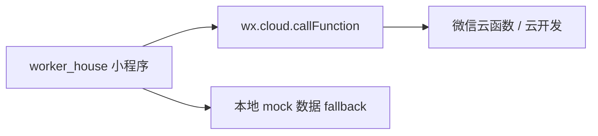
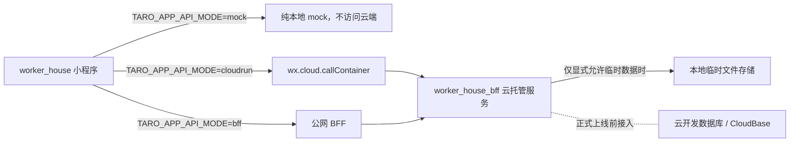

# worker_house 云托管迁移说明

> [!IMPORTANT]
> **当前状态：环境 ID 已配置**
> - 环境 ID 已固定：`prod-d9g991lo4dba5a4da`
> - **支付链路**：商城与活动报名已固定使用 `cloudrun`，不再读取小程序构建环境变量。

本轮目标是把 `worker_house` 小程序与 `worker_house_bff` 后端改造成“微信云托管就绪”状态，但**不执行部署**。后续待用户开通云托管并提供真实环境 ID 后，再执行部署任务。

## 一、迁移前后架构对比

### 迁移前


```mermaid
flowchart LR
  A[worker_house 小程序] --> B[wx.cloud.callFunction]
  B --> C[微信云函数 / 云开发]
  A --> D[本地 mock 数据 fallback]
```

### 迁移后（本轮完成）


```mermaid
flowchart LR
  A[worker_house 小程序]
  A -->|TARO_APP_API_MODE=mock| D[纯本地 mock，不访问云端]
  A -->|TARO_APP_API_MODE=bff| B[公网 BFF]
  A -->|TARO_APP_API_MODE=cloudrun| C[wx.cloud.callContainer]
  C --> E[worker_house_bff 云托管服务]
  B --> E
  E -->|仅显式允许临时数据时| F[本地临时文件存储]
  E -.正式上线前接入.- G[云开发数据库 / CloudBase]
```

## 二、本轮已完成的改动清单

### `worker_house_bff/`

- 新增 `Dockerfile`，采用多阶段构建，最终镜像仅保留 `dist` 与生产依赖。
- 新增 `.dockerignore`，排除 `node_modules`、`dist`、`.env*`、`logs`、`.git`。
- 新增 `container.config.json`，包含 `containerPort=8080`、`minNum=0`、`MODE=cloudrun` 等云托管元数据。
- 新增 `src/middlewares/wx-cloudrun-auth.ts`，读取微信云托管自动注入的身份 Header。
- 扩展 `src/config.ts`，支持 `mock / wechat / cloudrun` 三种模式，并兼容旧的 `CLOUD_MODE`。
- 调整路由鉴权模型：
  - 管理端写接口继续使用原有 `authMiddleware`
  - 小程序写接口改为使用 `wxCloudrunAuth`
  - 公开读接口对小程序直接开放
- 补充 `GET /api/health`，返回 `status / mode / persistence / timestamp`。
- 云托管默认禁止使用临时文件数据处理业务请求；只有显式设置
  `ALLOW_EPHEMERAL_CLOUDRUN_DATA=true` 时才允许联调用的临时数据，避免把容器文件系统误当成生产数据库。
- 更新 `README.md`，补充三种运行模式与云托管部署指南。
- 新增 `scripts/deploy-cloudrun.md` 作为部署 runbook。

### `worker_house/`

- 新增 `src/services/cloudrun.ts`，封装 `wx.cloud.callContainer`。
- 新增 `src/services/request.ts`，支持 `mock / bff / cloudrun` 三档运行时切换。
- 更新 `src/cloud/index.ts`，使用 `src/constants/runtime.ts` 中的固定云环境配置完成初始化。
- 更新 `src/cloud/services.ts`，在不改页面业务调用方式的前提下，把请求层接入到新的 runtime 开关。
- 新增 `.env.example`，仅保留通用 API 模式、BFF 和资源地址等可变配置示例。

## 三、用户还需要做的步骤

1. 在微信公众平台为小程序开通云托管。
2. 创建或确认云托管服务名，建议使用 `worker-house-bff`。
3. 拿到真实环境 ID，例如 `prod-xxxx`。
4. 把环境 ID 告诉我。
5. 我再基于当前仓库继续执行下一轮“实际部署 + 联调验证”任务。

## 四、部署后小程序配置

支付模式、云环境 ID 与云托管服务名已在 `worker_house/src/constants/runtime.ts` 固定，不需要再配置 `.env` 或 GitHub Variables。

如需先走公网 BFF，则改为：

```bash
TARO_APP_API_MODE=bff
TARO_APP_BFF_BASE_URL=https://your-bff-domain
```

## 五、回滚方案

如果需要回滚支付链路，需修改 `worker_house/src/constants/runtime.ts` 并重新构建小程序。其他通用数据链路仍可通过环境变量调整：

- 回滚到纯本地数据：`TARO_APP_API_MODE=mock`
- 回滚到公网 BFF：`TARO_APP_API_MODE=bff`

对于 BFF 侧，如果不想走云托管，可继续使用：

- `MODE=mock`
- `MODE=wechat`

## 六、当前边界说明

- 本轮没有登录微信公众平台，也没有调用云托管 API。
- 商城订单与活动报名支付单已接入同环境 CloudBase 文档数据库；其他文件型 BFF 写接口仍返回 `503`，这是有意设置的上线保护。
- 支付密钥未配置或 `ENABLE_SHOP=false` 时不会发起真实支付。
- 本轮没有改动小程序 UI，也没有删除 `PAYMENT_REMOVAL_NOTES.md`、`UPLOAD_GUIDE.md`、`REDESIGN_CHANGELOG.md`、`UI_TUNING_NOTES.md`。
